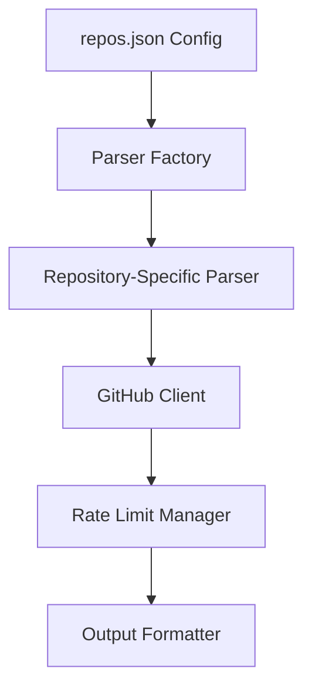

# Documentation Toolkit

Professional Python toolkit for documentation analysis and repository management, specifically optimized for Prebid projects but extensible to any GitHub repository. Features a sophisticated configuration-driven architecture with intelligent rate limiting, comprehensive caching, and extensible parsing framework.

## 🚀 Quick Start

```bash
# Install dependencies
uv sync

# Set up environment
cp .env.example .env
# Edit .env and add your GITHUB_TOKEN (optional but recommended)

# Run interactively
repo-modules

# Or directly with a specific repository
repo-modules --repo prebid-js --version v9.51.0
```

## 📋 Table of Contents

- [Overview](#overview)
- [Architecture](#architecture)
- [Available Tools](#available-tools)
- [Installation & Setup](#installation--setup)
- [Usage Examples](#usage-examples)
- [Configuration](#configuration)
- [Development](#development)
- [API Reference](#api-reference)
- [Contributing](#contributing)

## 🎯 Overview

The Documentation Toolkit is designed to solve complex repository analysis challenges through:

### Core Capabilities
- **Multi-Repository Support**: Prebid.js, Prebid Server (Go/Java), documentation sites
- **Historical Analysis**: Track when modules were first introduced and in which versions
- **Alias Discovery**: Find and extract bid adapter aliases across different file formats
- **Intelligent Rate Limiting**: Prevent GitHub API exhaustion with adaptive throttling
- **Configuration-Driven**: No hardcoded repository logic - everything configurable
- **Professional Tooling**: Type safety, comprehensive testing, automated validation

### Supported Repositories
| Repository | Purpose | Features |
|------------|---------|----------|
| **prebid-js** | JavaScript modules & adapters | Metadata-driven parsing, historical tracking |
| **prebid-server** | Go server implementation | Directory analysis, multi-path parsing |
| **prebid-server-java** | Java server implementation | Package parsing, module categorization |
| **prebid-docs** | Documentation site | Markdown analysis, master branch override |

## 🏗️ Architecture

### Configuration-Driven Design


**Key Principles:**
- **Zero Hardcoding**: All repository behavior defined in configuration
- **Extensible Parsers**: Easy addition of new repository types
- **Shared Utilities**: Common functionality across all tools
- **Intelligent Caching**: Performance optimization through strategic caching
- **Rate Limit Safety**: Adaptive throttling prevents API exhaustion

### Project Structure
```
documentation-toolkit/
├── src/
│   ├── repo_modules/           # Core repository analysis tool
│   │   ├── main.py            # CLI entry point & interactive menu
│   │   ├── config.py          # Configuration management
│   │   ├── github_client.py   # GitHub API integration
│   │   ├── parser_factory.py  # Extensible parser framework
│   │   ├── module_history.py  # Historical data tracking
│   │   ├── build_history_cli.py # Historical data builder
│   │   ├── version_cache.py   # Version caching system
│   │   └── repos.json         # Repository configurations
│   ├── alias_mappings/         # Alias discovery tool
│   │   ├── main.py            # CLI for finding aliases
│   │   └── alias_finder.py    # Core alias extraction logic
│   ├── shared_utilities/       # Common functionality
│   │   ├── rate_limit_manager.py # GitHub API rate limiting
│   │   ├── output_formatter.py   # Consistent file generation
│   │   ├── filename_generator.py # Standardized naming
│   │   └── telemetry.py          # OpenTelemetry integration
│   └── dev_tools/              # Development & validation
│       ├── cli.py             # Project validation CLI
│       ├── validator.py       # Code quality checks
│       └── docs_sync.py       # Documentation synchronization
├── tests/                      # Comprehensive test suite
├── cache/                      # Caching for performance
│   ├── versions/              # Version discovery cache
│   └── history/               # Historical data cache
└── pyproject.toml             # Project configuration
```

## 🛠️ Available Tools

### 1. repo-modules (Primary Tool)
**Purpose**: Extract and categorize modules/adapters from GitHub repositories

```bash
# Interactive mode with guided repository selection
repo-modules

# Direct usage
repo-modules --repo prebid-js --version v9.51.0

# With historical data enrichment
repo-modules --repo prebid-js --version v9.51.0 --use-cached-history

# List available preconfigured repositories
repo-modules --list-repos

# Custom repository
repo-modules --repo owner/custom-repo --version main
```

**Key Features:**
- Interactive menu system for repository/version selection
- Multiple fetch strategies: `full_content`, `filenames_only`, `directory_names`
- Historical data enrichment showing when modules were first added
- Automatic output filename generation with customizable slugs
- Multi-path parsing for complex repository structures
- Version override system (e.g., always use master for docs)

**Output Example:**
```
prebid.js_modules_version_v9.51.0.txt
prebid.server.go_modules_version_v3.8.0.txt
prebid.github.io_modules_version_master.txt
```

### 2. build-module-history (Historical Data Builder)
**Purpose**: Build comprehensive historical data cache showing when each module was first introduced

```bash
# Build complete historical cache
build-module-history --repo prebid-js

# Incremental updates (only process uncached modules)
build-module-history --repo prebid-js --incremental

# Custom batch processing
build-module-history --repo prebid-js --batch-size 10 --incremental

# Check current cache status
build-module-history --repo prebid-js --status
```

**Key Features:**
- **Intelligent Rate Limiting**: Adaptive throttling based on GitHub API quota
- **Incremental Processing**: Only processes modules not already cached
- **Batch Processing**: Configurable batch sizes for optimal performance
- **Progress Tracking**: Real-time progress with ETA calculations
- **Resume Capability**: Automatically resumes from interruptions
- **File Path Validation**: Prevents "No commits found" errors through smart path detection
- **Collision Prevention**: Uses file paths as cache keys to prevent module type conflicts

**Cache Structure:**
```json
{
  "modules/exampleBidAdapter.js": {
    "name": "example",
    "first_commit_date": "2018-03-15T10:30:00Z",
    "first_commit_sha": "abc123...",
    "first_release_version": "v1.5.0",
    "first_release_date": "2018-04-01T00:00:00Z",
    "file_path": "modules/exampleBidAdapter.js"
  }
}
```

### 3. alias-mappings (Alias Discovery Tool)
**Purpose**: Find and extract bid adapter aliases from repository files

```bash
# JavaScript mode (Prebid.js)
alias-mappings --mode js --repo prebid-js --version v9.51.0

# YAML mode (Prebid Server Go)
alias-mappings --mode server --repo prebid-server --version v3.8.0

# Java YAML mode (Prebid Server Java)
alias-mappings --mode java-server --repo prebid-server-java --version v3.27.0

# Batch processing with rate limiting
alias-mappings --mode js --repo prebid-js --version v9.51.0 --batch-size 20
```

**Key Features:**
- **Multi-Format Support**: JavaScript, Go YAML, Java YAML
- **Batch Processing**: Rate-limited processing for large repositories
- **Commented Alias Detection**: Finds aliases in code comments
- **Resume Functionality**: Continue from previous interruption
- **Structured Output**: JSON metadata with detailed statistics

**Modes:**
- **js**: Searches JavaScript files for `aliases: [...]` arrays
- **server**: Searches YAML files for alias configurations
- **java-server**: Searches Java YAML files for alias mappings

### 4. validate-project (Development Tool)
**Purpose**: Comprehensive project validation and maintenance

```bash
# Run complete validation pipeline
validate-project

# Or use directly with uv
uv run validate-project
```

**Validation Pipeline:**
1. **Code Formatting**: `ruff format` + `black` for consistent style
2. **Linting**: `ruff check` for code quality issues
3. **Type Checking**: `mypy` for type safety validation
4. **Testing**: `pytest` for functionality verification
5. **Documentation**: Updates README timestamps
6. **Synchronization**: Syncs agent instruction files (CLAUDE.md, AGENTS.md, GEMINI.md)

## 💾 Installation & Setup

### Requirements
- **Python 3.13+** (for modern type features and performance)
- **uv** (recommended) or pip for dependency management
- **GitHub Token** (optional but recommended for higher rate limits)

### Installation Steps

1. **Clone and Setup Environment**
   ```bash
   git clone <repository-url>
   cd documentation-toolkit
   uv sync  # or pip install -e .
   ```

2. **Configure Environment**
   ```bash
   cp .env.example .env
   # Edit .env and add your GITHUB_TOKEN
   ```

3. **Verify Installation**
   ```bash
   repo-modules --help
   validate-project
   ```

### Environment Variables

| Variable | Description | Required | Default |
|----------|-------------|----------|---------|
| `GITHUB_TOKEN` | GitHub Personal Access Token | No | None (60 req/hour) |
| `OTEL_EXPORTER_OTLP_ENDPOINT` | OpenTelemetry endpoint | No | None |
| `OTEL_SERVICE_NAME` | Service name for tracing | No | documentation-toolkit |

**Creating a GitHub Token:**
1. Go to [GitHub Settings > Tokens](https://github.com/settings/tokens)
2. Generate new token with `public_repo` scope
3. Add to `.env` file: `GITHUB_TOKEN=your_token_here`

## 🎯 Usage Examples

### Basic Repository Analysis
```bash
# Interactive mode - guided experience
repo-modules

# Select prebid-js
# Choose version v9.51.0
# Output: prebid.js_modules_version_v9.51.0.txt
```

### Historical Analysis Workflow
```bash
# 1. Build historical cache (one-time setup)
build-module-history --repo prebid-js --incremental

# 2. Use historical data in analysis
repo-modules --repo prebid-js --version v9.51.0 --use-cached-history

# 3. Check cache status
build-module-history --repo prebid-js --status
```

### Alias Discovery Workflow
```bash
# Discover aliases in Prebid.js
alias-mappings --mode js --repo prebid-js --version v9.51.0

# Output: prebid.js_alias_mappings_v9.51.0.txt
# Contains: adapter_name -> [alias1, alias2, ...]
```

### Custom Repository Setup
```bash
# 1. Add to src/repo_modules/repos.json
{
  "custom-repo": {
    "repo": "owner/repository",
    "description": "Custom repository",
    "versions": ["main"],
    "parser_type": "default",
    "fetch_strategy": "full_content"
  }
}

# 2. Use with tool
repo-modules --repo custom-repo --version main
```

## ⚙️ Configuration

### Repository Configuration (repos.json)

```json
{
  "repository-key": {
    "repo": "owner/repository-name",
    "description": "Human-readable description",
    "versions": ["master", "v1.0.0", "v2.0.0"],
    "parser_type": "specialized_parser",
    "fetch_strategy": "filenames_only",
    "output_filename_slug": "custom.name",
    "version_override": "master",
    "paths": {
      "Category Name": "path/to/directory",
      "Another Category": "different/path"
    }
  }
}
```

**Configuration Fields:**

| Field | Type | Description | Options |
|-------|------|-------------|---------|
| `repo` | string | GitHub repository in "owner/name" format | Required |
| `description` | string | Human-readable description | Required |
| `versions` | array | Available versions for this repository | Required |
| `parser_type` | string | Parser to use for this repository | `default`, `prebid_js`, `prebid_server_go`, `prebid_server_java`, `prebid_docs` |
| `fetch_strategy` | string | How to fetch repository data | `full_content`, `filenames_only`, `directory_names` |
| `output_filename_slug` | string | Custom prefix for output files | Optional |
| `version_override` | string | Force specific version regardless of user input | Optional |
| `paths` | object | Multi-directory parsing configuration | Optional |

### Fetch Strategies

| Strategy | Use Case | Performance | API Calls |
|----------|----------|-------------|-----------|
| `full_content` | Complete file analysis | Slow | High |
| `filenames_only` | Structure analysis | Fast | Low |
| `directory_names` | Folder structure | Fastest | Lowest |

### Parser Types

| Parser | Repository Type | Specialization |
|--------|----------------|----------------|
| `default` | Generic repositories | Basic file listing |
| `prebid_js` | Prebid.js | Module categorization, metadata parsing |
| `prebid_server_go` | Prebid Server Go | Directory structure analysis |
| `prebid_server_java` | Prebid Server Java | Java package parsing |
| `prebid_docs` | Documentation sites | Markdown analysis |

## 🔧 Development

### Development Workflow

1. **Make Changes**
   ```bash
   # Edit code
   # Add tests
   ```

2. **Run Validation**
   ```bash
   validate-project
   ```

3. **Fix Issues**
   ```bash
   # Format code
   uv run ruff format .
   
   # Fix linting
   uv run ruff check --fix .
   
   # Run specific tests
   uv run pytest tests/test_repo_modules/ -v
   ```

### Individual Development Commands

```bash
# Code formatting
uv run ruff format .
uv run black .

# Linting
uv run ruff check .
uv run ruff check --fix .  # Auto-fix issues

# Type checking
uv run mypy src/

# Testing
uv run pytest -v                    # All tests
uv run pytest tests/test_repo_modules/ -v  # Specific module
uv run pytest -k "test_parser" -v   # Pattern matching

# Full validation
validate-project
```

### Adding New Repository Support

1. **Add Configuration**
   ```json
   // src/repo_modules/repos.json
   {
     "new-repo": {
       "repo": "owner/repository",
       "description": "New repository",
       "versions": ["main"],
       "parser_type": "custom_parser",
       "fetch_strategy": "filenames_only"
     }
   }
   ```

2. **Create Parser (if needed)**
   ```python
   # src/repo_modules/parser_factory.py
   class CustomParser(BaseParser):
       def parse(self, data: dict[str, Any]) -> str:
           # Custom parsing logic
           return formatted_output
   ```

3. **Register Parser**
   ```python
   # src/repo_modules/parser_factory.py
   _parsers = {
       "custom_parser": CustomParser,
       # ... existing parsers
   }
   ```

4. **Add Tests**
   ```python
   # tests/test_repo_modules/test_custom_parser.py
   def test_custom_parser():
       # Test custom parser functionality
       pass
   ```

### Testing Strategy

**Test Organization:**
- **Unit Tests**: Individual component testing
- **Integration Tests**: Cross-component functionality
- **Mock-Based**: GitHub API interaction simulation
- **Fixture-Driven**: Reusable test data

**Key Test Areas:**
- Parser functionality across repository types
- GitHub client rate limiting and caching
- Configuration loading and validation
- Historical data accuracy
- Output format consistency

### Code Quality Standards

- **Type Safety**: Full mypy compliance
- **Code Style**: ruff + black formatting
- **Test Coverage**: Comprehensive test suite
- **Documentation**: Docstrings for all public APIs
- **Error Handling**: Graceful degradation with clear messages

## 📚 API Reference

### Core Classes

#### GitHubClient
```python
from src.repo_modules.github_client import GitHubClient

client = GitHubClient(token="your_token")
data = client.fetch_repository_data(
    repo_name="owner/repo",
    version="v1.0.0",
    directory="modules",
    fetch_strategy="filenames_only"
)
```

#### ModuleHistoryTracker
```python
from src.repo_modules.module_history import ModuleHistoryTracker

tracker = ModuleHistoryTracker("owner/repo")
history = tracker.get_module_history(["module1", "module2"])
```

#### RateLimitManager
```python
from src.shared_utilities import global_rate_limit_manager

# Check if safe to make requests
is_safe, reason = global_rate_limit_manager.check_rate_limit_safety(10)

# Get recommended batch size
batch_size = global_rate_limit_manager.get_recommended_batch_size(20)
```

### Configuration API

#### Loading Repository Configuration
```python
from src.repo_modules.config import get_available_repos, get_repo_config

repos = get_available_repos()
config = get_repo_config("prebid-js")
```

### Parser API

#### Creating Custom Parsers
```python
from src.repo_modules.parser_factory import BaseParser

class CustomParser(BaseParser):
    def parse(self, data: dict[str, Any]) -> str:
        # Custom parsing logic
        return self._format_output(data)
    
    def _format_output(self, data: dict) -> str:
        # Implementation details
        pass
```

## 🤝 Contributing

### Contribution Guidelines

1. **Fork and Clone**
   ```bash
   git clone your-fork-url
   cd documentation-toolkit
   ```

2. **Create Feature Branch**
   ```bash
   git checkout -b feature/your-feature-name
   ```

3. **Develop with Quality**
   ```bash
   # Make changes
   # Add tests
   validate-project  # Ensure all checks pass
   ```

4. **Submit Pull Request**
   - Clear description of changes
   - Reference any related issues
   - Ensure CI passes

### Development Standards

- **Type Hints**: Required for all public APIs
- **Testing**: Comprehensive test coverage for new features
- **Documentation**: Update README and docstrings
- **Backward Compatibility**: Maintain API compatibility where possible
- **Performance**: Consider rate limiting and caching implications

### Bug Reports

When reporting bugs, include:
- Tool and command used
- Expected vs actual behavior
- Repository and version being analyzed
- Error messages and logs
- Environment details (Python version, OS)

### Feature Requests

For new features, consider:
- Use case and motivation
- Proposed API or configuration changes
- Impact on existing functionality
- Implementation complexity

## 📄 License & Dependencies

### Dependencies

**Core Dependencies:**
- `click>=8.1.0` - CLI framework
- `pygithub>=2.6.1` - GitHub API integration
- `requests>=2.31.0` - HTTP client
- `loguru>=0.7.0` - Enhanced logging
- `python-dotenv>=0.21.0` - Environment management
- `pyyaml>=6.0.0` - YAML parsing

**Development Dependencies:**
- `mypy>=1.16.1` - Type checking
- `pytest>=7.0.0` - Testing framework
- `ruff>=0.3.0` - Fast linting and formatting
- `black>=24.0.0` - Code formatting
- `opentelemetry-*` - Observability

### Version Requirements
- **Python 3.13+** for modern type features and performance improvements
- **uv** recommended for fast dependency management

---

**Last updated**: 2025-06-28 09:00:00

**Project Version**: 0.1.0

**Maintainers**: Documentation Toolkit Team

For detailed API documentation and advanced usage examples, see the individual tool documentation in the `src/` directories.

Last updated: 2025-06-28 09:12:02
